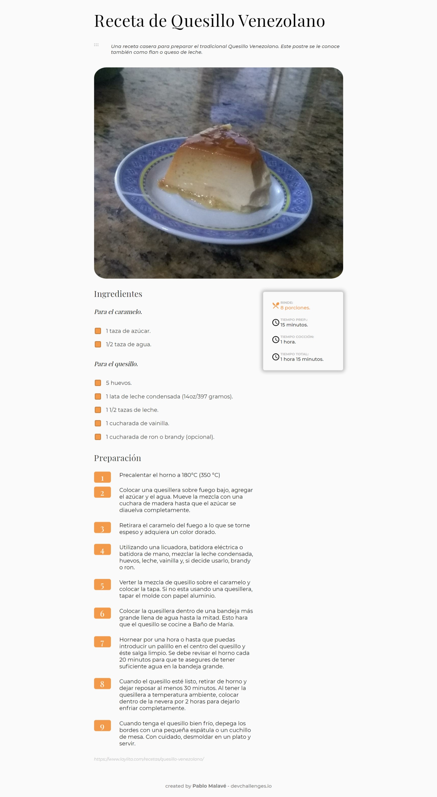
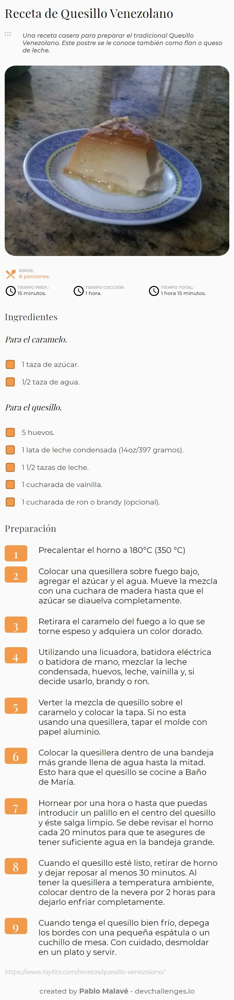

<!-- Please update value in the {}  -->

<h1 align="center">Venezuelan Quesillo - Recipe</h1>

   Solution for a challenge from  <a href="http://devchallenges.io" target="_blank">Devchallenges.io</a>.

  <h3>
    <a href="https://04-receta.vercel.app/">
      Demo
    </a>
     | 
    <a href="https://github.com/pablomalave/03.interior-consultant-master.git">
      Solution
    </a>
     | 
    <a href="https://devchallenges.io/challenges/OEKdUZ6xs0h99C38XVht">
      Challenge
    </a>
  </h3>

<!-- TABLE OF CONTENTS -->

## Table of Contents

- [Overview](#overview)
  - [Built With](#built-with)
- [Features](#features)
- [Acknowledgements](#acknowledgements)
- [Contact](#contact)

<!-- OVERVIEW -->

## Overview

This website shows a recipe for Quesillo Venezolano, a delicious dessert from my country. 

In this project, Flexbox is used for the distribution of the elements on the screen for both Desktop and Mobile.

The challenge proposes the use of Checbox to keep track of the ingredients. The customization of custom CheckBoxes is highlighted to obtain uniformity in all browsers.

### Built With

<!-- This section should list any major frameworks that you built your project using. Here are a few examples.-->

- HTML, CSS.
- CSS Flexbox.

## Features

<!-- List the features of your application or follow the template. Don't share the figma file here :) -->

This application/site was created as a submission to a [DevChallenges](https://devchallenges.io/challenges) challenge. The [challenge](https://devchallenges.io/challenges/TtUjDt19eIHxNQ4n5jps) was to build an application to complete the following user stories:

- [x] User story: I can see a recipe with ingredients and instructions
- [x] User story: I can select a checkbox if I have the ingredients
- [x] User story: I can see the number of servings, baking times

## Acknowledgements

<!-- This section should list any articles or add-ons/plugins that helps you to complete the project. This is optional but it will help you in the future. For exmpale -->

- Chris Coyer. [A Complete Guide to Flexbox. ](https://css-tricks.com/snippets/css/a-guide-to-flexbox/) 2013 - 2021.
- Thu Nghiem[Steps to replicate a design with only HTML and CSS.](https://devchallenges-blogs.web.app/how-to-replicate-design/) 2020.
- W3 Schools. [Responsive Web Design - Media Queries](https://www.w3schools.com/css/css_rwd_mediaqueries.asp)
- Anto Fernandez. [Personalizar un checkbox con CSS](http://www.antofernandez.com/pesonalizar-checkbox-con-css/)

## Contact

- Website [Pablo Malave - GithubPages](https://pablomalave.github.io/CV/)
- GitHub [@pablomalave](https://github.com/pablomalave)